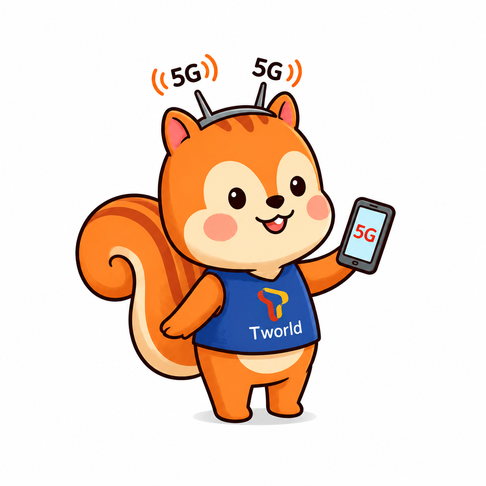
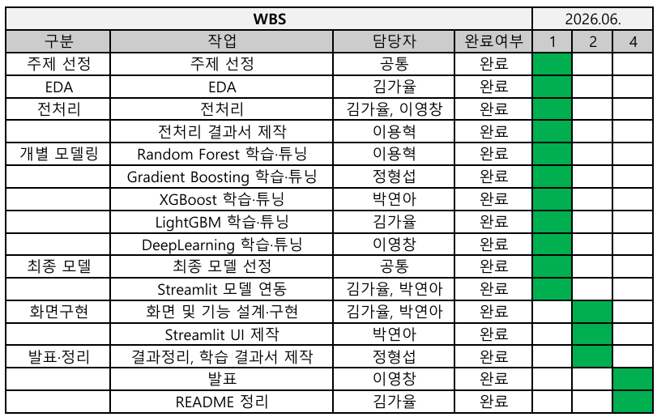
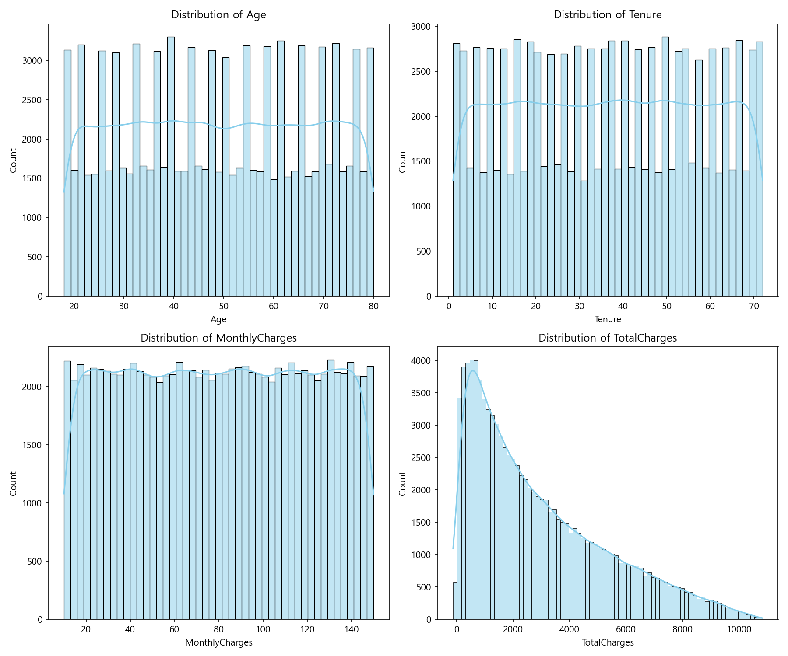
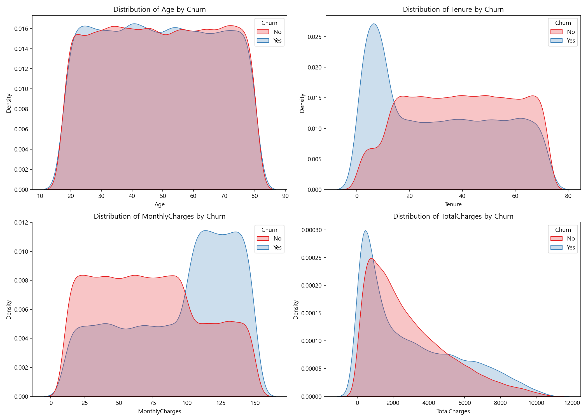
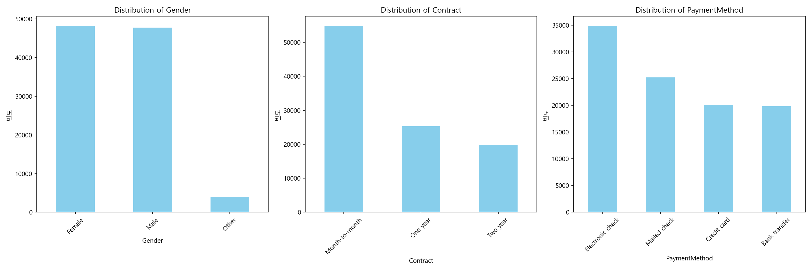
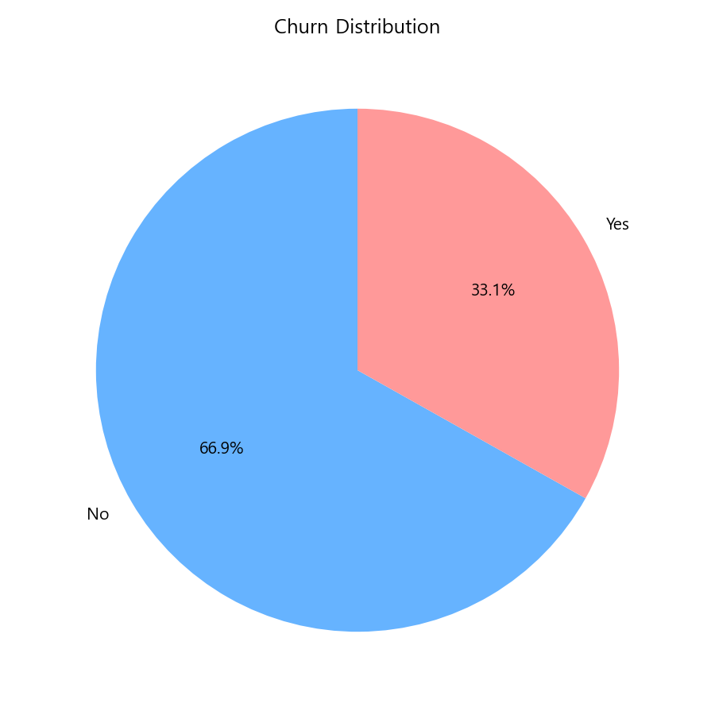
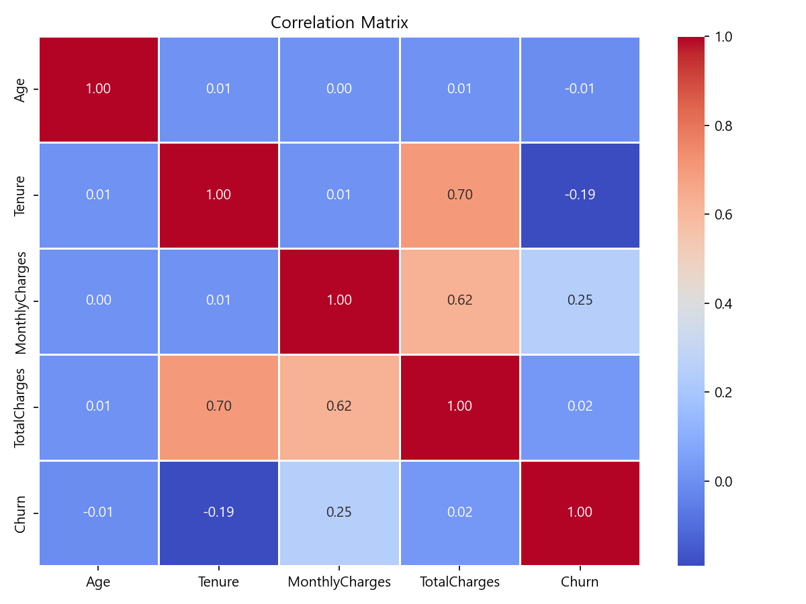
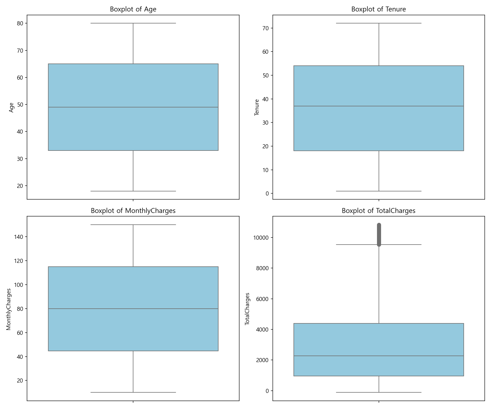
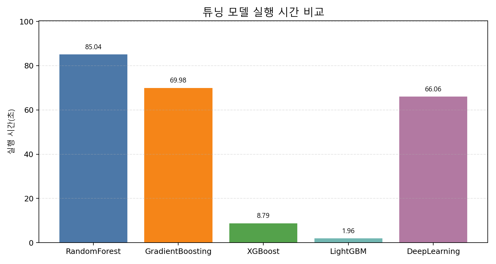

# SKN31-2nd-2Team
<p align="center">

</p>

## 팀원 및 역할
<div align="center">
<table align="center">
  <tr>
    <td align="center" width="190px"></td>
    <td align="center" width="190px"></td>
    <td align="center" width="190px"></td>
    <td align="center" width="190px"></td>
    <td align="center" width="190px"></td>
  </tr>
  <tr>
    <td align="center"><b>김가율(PM)</b></td>
    <td align="center"><b>정형섭</b></td>
    <td align="center"><b>박연아</b></td>
    <td align="center"><b>이용혁</b></td>
    <td align="center"><b>이영창</b></td>
  </tr>
    <tr>
    <td align="center">Readme<br>LightGBM</td>
    <td align="center">학습 결과서<br>GradientBoosting</td>
    <td align="center">Streamlit<br>XGBoost</td>
    <td align="center">전처리 결과서<br>RandomForest</td>
    <td align="center">발표<br>Deeplearning</td>
  </tr>
  
</table>

</div>

---

## **프로젝트 명:** 고객 이탈(Churn) 예측 모델 구축을 위한 데이터 탐색

**분석 데이터:** synthetic_customer_churn_100k.csv  
(출처 : https://www.kaggle.com/datasets/dhrubangtalukdar/telco-customer-churn-data)

본 프로젝트는 Telco 유저들의 이용 행태 및 결제 데이터를 분석하여, 향후 서비스 탈퇴(이탈) 가능성이 높은 사용자를 예측하는 머신러닝 모델 개발 프로젝트입니다. 데이터 전처리, 탐색적 데이터 분석(EDA), 그리고 예측 모델링 과정을 포함하고 있습니다.

---
## 저장소 구조 (Repository Structure)

```
SKN31-2nd-2Team
├─ app.py                                          # streamlit 화면 구현
├─ data
│  ├─ eda_plots                                    # EDA 그래프 데이터 모음
│  └─ synthetic_customer_churn_100k.csv            # 원본 데이터셋 (Raw Data)
├─ models
│  ├─ RandomForest                                 # RandomForest 모델링 데이터
│  ├─ GradientBoosting                             # GradientBoosting 모델링
│  ├─ XGBoost                                      # XGBoost 모델링 데이터
│  ├─ DeepLearning                                 # DeepLearning 모델링 데이터
│  └─ LightGBM                                     # LightGBM 모델링 데이터
├─ outputs
│  ├─ 1_preprocessing_report.md                    # 전처리 결과서
│  ├─ 2_model_training_report.md                   # 학습 결과서
│  └─ model_training_time_bar.png
├─ README.md                                       # 프로젝트 소개 및 데이터 명세서
└─ requirements.txt

```
---
## Tech Stack
### 🧠 AI & Data Science
    

### 💻 Frontend
 

### ⚙️ Backend
 

### 🚀 DevOps & Tools
  

---
### WBS
---


---

## 1. 프로젝트 배경

오늘날 이동통신 시장은 신규 고객 유치 비용(CAC, Customer Acquisition Cost)이 기존 고객을 유지하는 비용보다 수 배 이상 높게 발생하는 '성숙기·포화 시장'의 특성을 띄고 있습니다. 무제한 요금제 경쟁, 결합 상품 다변화, 그리고 다양한 알뜰폰(MVNO) 사업자의 등장은 고객이 언제든 더 나은 조건의 경쟁사로 번호이동을 할 수 있는 환경을 제공합니다. 

특히 본 프로젝트에서 활용한 대규모 고객 데이터 분석 결과, **전체 고객의 약 33.1%에 달하는 인원이 이탈(Churn)하는 심각한 시그널이 관측**되었습니다. 이는 기업의 장기적인 매출 안정성을 크게 위협하는 수치입니다. 따라서 사후에 이탈한 고객을 붙잡는 소모적인 마케팅에서 벗어나, 데이터에 기반해 **'이탈 징후가 보이기 직전의 고객'을 선제적으로 감지하고 방어할 수 있는 데이터 기반의 정밀한 이탈 예측 시스템**이 요구되는 시점입니다.

---

## 2. 프로젝트 필요성

* **이상치 정제 및 데이터 신뢰성 확보**
  * 초기 데이터 탐색(EDA) 결과, 고객의 총 청구 금액(`TotalCharges`) 데이터 중 일부에서 **음수(-) 값의 기록 오류(이상치)가 발견**되었습니다. 현업 데이터에서 발생할 수 있는 이러한 노이즈를 방치한 채 모델을 학습시키면 예측 성능이 왜곡됩니다. 이에 따라 체계적인 데이터 정제(Data Cleaning)와 신뢰할 수 있는 데이터 파이프라인 구축이 필수적입니다.
* **다중공선성 및 복잡한 변수 관계의 극복**
  * 가입 기간(`Tenure`), 월 요금(`MonthlyCharges`), 총 청구 금액(`TotalCharges`)은 서로 매우 강한 선형 상관관계(다중공선성)를 가집니다. 일반적인 통계 모델로는 분석이 어려운 복잡한 관계를 효과적으로 다루기 위해, 다중공선성에 강건하면서도 대용량 데이터 처리 속도가 압도적인 머신러닝 알고리즘(LightGBM, XGBoost 등)을 도입한 고성능 모델 개발이 필요합니다.
* **타겟 마케팅으로의 패러다임 전환**
  * 모든 고객에게 무차별적으로 혜택이나 프로모션을 제공하는 비용 낭비형 마케팅에서 탈피해야 합니다. 이탈 확률이 높은 고위험군 고객 리스트와 이탈에 영향을 미친 주요 요인(Feature Importance)을 정밀 타격하여, 한정된 마케팅 예산 안에서 방어 효율을 극대화(ROI 최적화)해야 합니다.

---

## 3. 핵심 분석 및 기대효과

### 핵심 분석 내용
* **대용량 데이터셋 기반의 다차원 EDA:** 100,000명의 대규모 익명 고객 데이터를 바탕으로 나이 분포, 계약 형태(Contract), 결제 수단(PaymentMethod)과 이탈률 간의 비즈니스적 인과관계를 입증했습니다.
* **LightGBM 기반 고속 파이프라인 구축:** 트리 기반 앙상블 알고리즘을 활용하여, 데이터 스케일링 단계를 최소화하면서도 정확도와 변별력(ROC-AUC 지표 등) 측면에서 모두 최적의 성능을 내는 파라미터를 자동 튜닝(Hyperparameter Tuning)했습니다.
* **이탈 영향 인자 도출:** 단순 예측에 그치지 않고, 고객이 이탈 결정을 내리게 만드는 핵심 변수가 무엇인지 분석하여 비즈니스 부서가 즉각적인 액션 플랜(예: 계약 형태 변경 유도 프로모션 등)을 세울 수 있도록 지원합니다.

### 기대 효과
* **마케팅 비용 절감 (ROI 최적화):** 이탈 확률 상위 5~10%의 고위험군 고객만을 정밀 선별하여 개인화 혜택(쿠폰, 요금제 업그레이드 등)을 집중 제공함으로써 무분별한 마케팅 리소스 낭비를 막습니다.
* **LTV (고객 생애 가치) 증대:** 이탈률을 단 1~2%만 낮추더라도 장기 약정 고객을 확보하는 효과를 낳으며, 이는 매월 고정적인 반복 매출(ARR)의 안정적인 상승으로 직결됩니다.
* **이탈 방어 프로세스 자동화:** 개발된 머신러닝 모델을 주기적인 배치(Batch) 형태로 연동하여, 매월 혹은 매주 이탈 위험도가 높아진 고객 리스트를 고객 센터(CRM)나 마케팅 시스템에 자동으로 전달하는 자동화 인프라를 확립할 수 있습니다.
---

## 4. 데이터셋 개요

- **가상 통신사 Telco**의 고객 이탈(churn) 자료
- 모든 데이터는 Python(pandas + numpy)로 시드 고정 후 생성한 **가공 데이터**
- 데이터셋은 총 100,000행(Rows), 9열(Columns)로 구성
- **변수 타입 구성:**
  * **수치형(Numerical) 변수:** `CustomerID`, `Age`, `Tenure`, `MonthlyCharges`, `TotalCharges` (5개)
  * **범주형(Categorical) 변수:** `Gender`, `Contract`, `PaymentMethod`, `Churn` (4개)

※ 통신사 고객 이탈 가공 데이터의 시초는 IBM Cognos Analytics용 샘플 데이터로 제공된 Telco Customer Churn이다. 이후 Kaggle에서 비슷한 유형의 데이터셋을 찾아볼 수 있으며 synthetic_customer_churn_100k도 그중 하나다.

### 4-1. 변수에 대한 설명

| 컬럼명 | 설명 | 데이터 타입 | 예시 |
|---|---|---|---|
| CustomerID | 고객 고유 식별자 | int | 1, 2, …, 100000 |
| Age | 고객 나이 (18–80세) | int | 51 |
| Gender | 고객 성별 | string | Male / Female / Other |
| Tenure | 서비스 이용 기간 (월, 1–72) | int | 58 |
| MonthlyCharges | 월 청구 금액 (USD, 약 10–150) | float | 95.92 |
| TotalCharges | 누적 청구 금액 (Tenure × MonthlyCharges + 노이즈) | float | 5530.46 |
| Contract | 계약 유형 | string | 월별 / 1년 / 2년 |
| PaymentMethod | 결제 수단 | string | 전자수표 / 우편수표 / 계좌이체 / 신용카드 |
| Churn | 이탈 여부 (타깃 변수) | string | Yes / No |  
<br>

## 5. 수치형 변수와 기초 통계량

| 변수명 | 평균값 (Mean) | 중위값 (50%) | 최솟값 (Min) | 최댓값 (Max) | 주요 특징 분석 |
| :--- | :---: | :---: | :---: | :---: | :--- |
| **Age** (나이) | 49.0세 | 49.0세 | 18.0세 | 80.0세 | 18세부터 80세까지 분포 |
| **Tenure** (가입기간) | 36.5개월 | 37.0개월 | 1.0개월 | 72.0개월 | 최소 1개월에서 최대 6년(72개월)까지의 가입 기간 |
| **MonthlyCharges** (월요금) | 79.9달러 | 80.0달러 | 10.0달러 | 150.0달러 | 최소 10달러~최대 150달러 사이에서 월요금 청구 |
| **TotalCharges** (총요금) | 2,926.1달러 | 2,268.0달러 | **-118.43달러** | 10,831.5달러 | **[오류 발견]** **총요금이 음수인 데이터(최소값: -118.43)** 가 존재 |

## 5.1 수치형 변수의 도수분포표


## 5.2 수치형 변수의 Target 특성별 분포

- 가입기간이 짧을수록 이탈률이 높음
- 월요금이 많을수록 이탈률이 

# 6. 범주형 변수와 기초 통계량

| 변수 | 범주 | 빈도 | 비율 | 주요 특징 분석 |
|------|------|-----:|-----:|------|
| **Gender** | Female | 48,256 | 48.26% | Female·Male 비율이 각각 약 48%로 균등한 분포 |
| | Male | 47,787 | 47.79% | |
| | Other | 3,957 | 3.96% | |
| **Contract** | Month-to-month | 54,915 | 54.92% | 단기 계약(Month-to-month)이 과반수(54.92%)로 중장기 계약간 이탈률 차이가 있을 것으로 예상 |
| | One year | 25,261 | 25.26% | |
| | Two year | 19,824 | 19.82% | |
| **PaymentMethod** | Electronic check | 34,892 | 34.89% | Electronic check가 34.89%로 가장 많고 나머지 3개 방식은 약 20%씩 고른 분포|
| | Mailed check | 25,221 | 25.22% | |
| | Credit card | 20,032 | 20.03% | |
| | Bank transfer | 19,855 | 19.86% | |

## 6.1 범주형 변수의 도수분포표


## 6.2 범주형 변수의 Target 특성별 비율

- 단기계약일수록 이탈률이 높음

## 7. 타겟 변수(Churn) 분포 분석

모델이 예측해야 하는 핵심 타겟 변수인 **고객 이탈 여부 (`Churn`)** 비율 분석


- **이탈하지 않은 고객 (No):** 66,856명 (**66.86%**)
- **이탈한 고객 (Yes):** 33,144명 (**33.14%**)
- **클래스 불균형 분석**<br>
  - Telco의 이탈률은 **약 33%** 로 국내 통신 3사 실제 이탈률 보다 높은 편
<br>

  **국내 통신 3사 해지율**

  | 연도 | SKT | KT | LGU+ | 출처 |
  |------|----:|----:|-----:|------|
  | 2021년 (연간, 월평균) | 0.83% | 1.43% | 1.36% | 서울경제 (2022.03.08) |
  | 연간 환산 (×12) | ≈ 10.0% | ≈ 17.2% | ≈ 16.3% | — |

<br>

## 8. 변수 간 상관관계 분석 (Correlation Matrix)

Target['Churn`] 변수를 LabelEcoder로 수치화(Yes=1, No=0)하여 연속형 변수 상관관계 분석


* **상관관계(Correlation) 분석** 
  - `TotalCharges`(총요금)는 `Tenure`(가입 기간) 및 `MonthlyCharges`(월요금)와 상관계수가 각각 0.70과 0.62로 강한 양의 상관관계를 보임(TotalCharges가 Tenure × MonthlyCharges + 노이즈임)

* **다중공선성(Multicollinearity) 분석** 
  - 통계학에서는 VIF값이 5이상이면 다중공선성 문제가 있다고 판단하여 상관관계가 있는 변수들 중에서 선택하여 제거함으로써 다중공선성 문제를 해결
  - Random Forest, Gradient Boosting, XGBoost, LightGBM 등은 트리 기반 앙상블 머신러닝 모델이기 때문에 설령 다중공선성 문제가 있더라고 성능(예측력) 자체에는 영향이 없음
  - 뿐만아니라 target을 예측하기 위한 features 개수가 7개 밖에 없어 여기에서 추가로 삭제를 한다면 예측력이 떨어질 것으로 예상되어 다중공선성 문제에 대한 처리는 하지 않음

  **VIF 분석 결과**

   | 변수 | VIF | 판단 |
    |------|----:|------|
    | TotalCharges | 11.164562 | 심각 (제거 또는 결합 고려) |
   | Tenure | 8.949542 | 중간 (주의 필요) |
   | MonthlyCharges | 8.319921 | 중간 (주의 필요) |
    | Age | 6.087550 | 중간 (주의 필요) |

  **VIF 해석 기준**
  - VIF = 1 : 다중공선성 없음
  - 1 ~ 5 : 낮음 (허용 가능)
  - 5 ~ 10 : 중간 (주의 필요)
  - 10 이상 : 심각 (제거 또는 결합 고려)
<br>

# 9. 결측치와 이상치 분석

- **결측치 현황** 
  - 모든 변수의 Non-Null Count가 100,000개로 일치하여 결측치 미존재
- **이상치 현황**
  - 총요금에 음수(-)값이 있고 이는 환불, 프로모션 크레딧 또는 시스템 기록 오류일 수 있으므로 모델에 적합한 데이터 전처리가 필요
  - 뿐만아니라 총요금의 Box-plot 상 상한값을 벗어나는 이상치가 존재하여 모델에 적합한 데이터 전처리가 필요




## 10. 데이터 전처리

## 10.1 이상치 처리

### 10.1.1 TotalCharges(총요금)의 음수(-)값 처리
- 총 100,000개 중 265개(0.265%)의 음수(-)가 존재
- 환불, 프로모션 크레딧 또는 시스템 기록 오류 가능성
- 전처리 방법
  1. 음수(-)를 0으로 대체

### 10.1.2 TotalCharges(총요금)의 상한 이상치 처리
- 총 100,000개 중 이상치 기준 상한인 9540.32를 벗어난 이상치가 841개(0.841%)가 존재
- 장기 고객의 경우 나타나는 자연스러운 현상으로 LightGBM 모델에서 전처리 진행하지 않음

## 10.2 Feature와 Target 분리(X, y 분리)

- 총 컬럼(9개): CustomerID, Age, Gender, Tenure, MonthlyCharges, Contract, PaymentMethod, TotalCharges, Churn
  - CustomerID는 삭제
- feature(7개): Age, Gender, Tenure, MonthlyCharges, Contract, PaymentMethod, TotalCharges<br>
  - categorical_columns = ['Gender', 'Contract', 'PaymentMethod']<br>
  - numerical_columns = ['Tenure', 'MonthlyCharges', 'TotalCharges', 'Age']
- target(1개): Churn
  - target은 LabelEncoder을 통해 Yes를 0으로 , No를 1로 변환


  | 구분 | 레이블 | 의미 | 건수 |
  |------|--------|------|-----:|
  | 변환 전 | No | 유지 | 66,856 |
  | 변환 전 | Yes | 이탈 | 33,144 |
  | 변환 후 | 0 | 유지 | 66,856 |
  | 변환 후 | 1 | 이탈 | 33,144 |

## 10.3 Train/Validation/Test set 분리

- train set(60%), validation set(20%), test set(20%)로 분리하여 데이터 준비

  | 변수 | 크기 |
  |------|-----:|
  | X_train | 60,000 |
  | y_train | 60,000 |
  | X_val | 20,000 |
  | y_val | 20,000 |
  | X_test | 20,000 |
  | y_test | 20,000 |


## 10.4 OneHotEncoding과 labelEcoding
- 범주형(categorical) 변수에 대해서는 LabelEncoding을 함
- 참고 사항 참조


## 10.5 Scaling
- 수치형(numeric) 변수에 대해서는 별도의 Scaling를 하지 않음
- 참고 사항 참조

## 10.6 참고 사항

**- 머신러닝에서의  Encoding과 Scaling 방법**


| 척도 | | 예 | 대소관계 | 차이 | 비 | 선형기반 모델 | 트리기반 모델 |
|---|---|---|:---:|:---:|:---:|---|---|
| 범주형 | 명목척도 | 학생번호 | ✕ | ✕ | ✕ | `OneHotEncoder(drop='first')` | `OneHotEncoder` → `LabelEncoder()` 가능 |
| | 순서척도 | 성적 순위 | ○ | ✕ | ✕ | `LabelEncoder()` | `LabelEncoder()` |
| 수치형 | 간격척도 | 온도 | ○ | ○ | ✕ | Scaling 필요 | Scaling 불필요 |
| | 비율척도 | 키 | ○ | ○ | ○ | Scaling 필요 | Scaling 불필요 |

- 설명력을 강조하는 통계학과 예측력을 중시하는 머신러닝에는 변수를 Encoding하고 Scaling하는 방법상 차이가 있음
- 통계학에서는 독립변수들  간에 다중공선성 문제가 발생하면 종속변수에 대한 설명력이 떨어지기 때문에 다중공선성 문제를 적극적으로 처리
- 반면 머신러닝에서는 설명력보다는 예측 결과를 중시하기 때문에 통계학에서보다는 다중공선성 문제가 덜 중요시됨
- 머신러닝에서도 선형기반 모델에서는 통계학과 가깝게 다중공선성 문제를 바라보지만 트리기반 모델은 다중공선성 문제가 훨씬 덜 중요시됨
- 명목변수를 OneHotEncodind할 때 통게학이나 선형기반 머신러닝 모델에서는 다중공선성 문제를 방지하기 위해 첫번째 열을 삭제하는 방법을 사용하여 더미(dummy)변수화 함(OneHotEncoder(drop='first'))
- 그러나 트리기반 모델에서는 첫번째 열을 삭제하면 설명력이 떨어지기 때문에 OneHotEncoding할 때 첫번째 열을 삭제하지 않고 사용하며 더 나아가 데이터 전처리의 편의성을 위해 실무적으로는 순서척도에 사용되는 LabelEncoding 방식을 선호
- scaling에 있어서도 통계학과 선형기반 머신러닝 모델에서는 scaling이 반드시 필요하지만 트리기반 머신러닝 모델에서는 불필요

\* 선형 알고리즘: Logistic Regression(Linear Regression), SVM, KNN<br>
\* 트리형 알고리즘: Decision Tree, Random Forest, Gradient Boosing(XGBoost, LightGBM, CatBoost)

## 10.7 향후 과제: 파생변수 생성을 통한 추가 분석

- synthetic_customer_churn_100k 데이터 셋은  수치형(Numerical) 변수 4개(`Age`, `Tenure`, `MonthlyCharges`, `TotalCharges`)와 범주형(Categorical) 변수 3게(`Gender`, `Contract`, `PaymentMethod`) 구성된 features들로 target인 이탈를을 예측하려고 함.
- features 수 부족이 target 예측력을 떨어뜨릴 수 있다는 가정하에 features 수 확대 방안 모색
- 통계학에서는 연구자가 도메인(domain) 지식을 바탕으로 설명력을 높일 수 있는 방향으로 feature 상호간의 연산을 통해 새로운 파생변수를 생성
- 머신러닝에서는 모델이 자동으로 feature를 대량 생성한 뒤 알아서 선택하게 함
- 선형기반 머신러닝 모델에서 사용하는 PolynomialFeatures라는 다항식 특성을 생성하는 변환기인 PolynomialFeatures가 대표적인 예

- 검토 가능한 파생변수
  1. 범주형 변수를 수치화하는 방법으로 새로운 파생변수 생성
      - 범주형 변수를 수치화하는 대표적 방법으로는 OneHotEncoder와 LabelEncoder 있음

  2. 수치형 변수를 군집화하여 그룹별로 분석 
      - 개별 연령보다는 연령대가 이탈률을 예측하는데 더 유의할 것이라는 가정하에 새로운 파생변수를 생성
      - 머신러닝의 비지도학습인 군집분석(Clustering) 활용 가능

  3. TotalCharges/Tenure
      - TotalCharges는 '총요금으로 Tenure × MonthlyCharges + 노이즈'으로 분해 가능한데 노이즈를 없앤 실질 월요금이라는 파생변수를 생성

  4. Tenure/(Age * 12개월)
      - 단순 가입기간보다는 생애주기에서 차지하는 가입기간 비율이 이탈률을 예축하는데 더 유의할 것이라는 가정하에 새로운 파생변수를 생성

## 11. 모델 학습 결과

## 1. 모델링 전략

### 1-1. 평가지표 선정

본 프로젝트는 Telco 고객 이탈(Churn) 예측 문제를 다룬다.  
평가지표는 Accuracy, Recall, Precision, F1-Score, ROC-AUC로 5개 지표를 선정하였다.
최종 모델 선정에서는 ROC-AUC를 가장 중요하게 보고, Accuracy, Precision, Recall, F1-Score를 보조 지표로 함께 확인하였다. ROC-AUC는 모델이 이탈 가능성이 높은 고객과 낮은 고객을 얼마나 잘 구분하는지 보여주므로, 고객별 이탈 위험도를 판단하는 데 중요한 기준이 된다.

| 지표 | 선정 이유 |
| --------- | ------------------------------------ |
| Accuracy | 전체 예측 중 정답을 맞힌 비율을 확인하여 모델의 기본 정확도를 비교하기 위해 선정 |
| Recall | 실제 이탈 고객을 얼마나 놓치지 않고 찾아내는지 평가하기 위해 선정 |
| Precision | 이탈로 예측한 고객 중 실제 이탈 고객의 비율을 확인하여 불필요한 마케팅 대상을 줄일 수 있는지 평가하기 위해 선정 |
| F1-Score | Precision과 Recall의 균형을 함께 평가하기 위해 선정 |
| ROC-AUC | 이탈 고객과 비이탈 고객을 구분하는 전체적인 분류 성능을 평가하기 위해 선정. 특히 고객별 이탈 위험도를 잘 구분하는지 판단하는 핵심 지표로 사용 |

---

### 1-2. 후보 모델 선정

후보 모델은 Random Forest, Gradient Boosting, XGBoost, LightGBM, Deep Learning으로 5개 모델을 선정하였다.

| 모델 | 유형 | 선정 근거 |
| ------------------- | ----- | ------------------------------------------ |
| Random Forest | 앙상블 | 여러 Decision Tree를 결합해 안정적인 성능을 기대할 수 있고, Feature Importance를 통해 주요 변수를 해석할 수 있어 선정 |
| Gradient Boosting | 부스팅 | 이전 모델의 오차를 순차적으로 보정하는 방식으로 정형 데이터 분류에서 성능 개선 가능성을 확인하기 위해 선정 |
| XGBoost | 부스팅 | 정형 데이터 분류 문제에서 성능이 검증된 대표 부스팅 모델이므로, 튜닝을 통한 성능 향상 가능성을 비교하기 위해 선정 |
| LightGBM | 부스팅 | 학습 속도와 메모리 효율이 좋아 데이터가 많아질 경우에도 운영 효율성을 기대할 수 있어 선정 |
| Deep Learning | 신경망 | 트리 기반 모델과 다른 방식의 비선형 패턴 학습 가능성과 성능을 비교하기 위해 선정 |

---

### 1-3. 실험 계획

* 5개 후보 모델(Random Forest, Gradient Boosting, XGBoost, LightGBM, Deep Learning)을 5명의 팀원이 각각 하나씩 담당하여 학습을 진행한다.
* 먼저 공통 비교 기준을 만들기 위해 기본 전처리(음수값 0으로 변환, Label Encoding)를 동일하게 적용한 데이터로 각 모델을 학습한다.
* 이후 각 담당자는 모델 특성에 맞는 추가 전처리와 하이퍼파라미터 튜닝을 적용하여 성능 개선 가능성을 확인한다.
* 최종 비교에서는 기본 전처리 성능과 모델별 전처리 및 튜닝 성능을 함께 제시하여, 동일 조건에서의 모델 성능과 개별 최적화 후 성능을 모두 비교한다.
* 모델 성능은 1-1에서 선정한 5개의 평가지표(Accuracy, Recall, Precision, F1-Score, ROC-AUC)를 기준으로 평가한다.
* 성능 지표뿐만 아니라 각 튜닝 모델의 실행 시간도 함께 측정하여, 예측 성능과 학습 효율성을 모두 비교한다.
* 최종 모델 선정 시에는 ROC-AUC를 핵심 성능 지표로 보고, 모델 간 성능 차이가 크지 않은 경우 실행 시간과 데이터 처리 효율성도 주요 선정 기준으로 함께 고려한다.


---

## 2. 모델 종합 비교 및 최적 모델 선정

### 2-1. 전체 모델 성능 비교표
**1) 기본 전처리(음수값 0으로 변환, Label Encoding)** 
| 순번 | 모델명 | Accuracy (정확도) | Recall (재현율) | Precision (정밀도) | F1-Score | ROC-AUC |
| :---: | :--- | :---: | :---: | :---: | :---: | :---: |
| **1** | **Random Forest** | **0.7600** | 0.7100 | **0.7300** | **0.7200** | 0.8045 |
| **2** | **GradientBoosting** | 0.7515 | **0.7200** | 0.7200 | **0.7200** | 0.8051 |
| **3** | **XGBoost** | 0.7082 | 0.6794 | 0.5483 | 0.6068 | 0.7982 |
| **4** | **LightGBM** | **0.7600** | 0.5515 | 0.6668 | 0.6037 | **0.8263** |
| **5** | **Deep Learning** | 0.7400 | 0.7100 | 0.7100 | 0.7100 | 0.7976 |

<br />

**2) 모델별 전처리 및 튜닝**
| 순번 | 모델명 | Accuracy (정확도) | Recall (재현율) | Precision (정밀도) | F1-Score | ROC-AUC |
| :---: | :--- | :---: | :---: | :---: | :---: | :---: |
| **1** | **Random Forest** | **0.7600** | **0.7100** | **0.7300** | **0.7200** | **0.8069** |
| **2** | **GradientBoosting** | 0.7555 | 0.6200 | 0.6400 | 0.6300 | 0.8062 |
| **3** | **XGBoost** | 0.7260 | 0.6588 | 0.5757 | 0.6145 | 0.8038 |
| **4** | **LightGBM** | 0.7528 | 0.6200 | 0.6300 | 0.6200 | 0.8055 |
| **5** | **Deep Learning** | 0.7500 | 0.5900 | 0.6300 | 0.6100 | 0.8004 |

<br />

**3) 튜닝모델 실행시간**

<!-- | 모델명 | 실행 시간(초) |
| --- | ---: |
| Random Forest | 85.04 |
| Gradient Boosting | 69.98 |
| XGBoost | 8.79 |
| LightGBM | 1.96 |
| Deep Learning | 66.06 | -->

<p align="center">
  
</p>

---

### 2-2. 지표별 최고 성능 모델

**1) 기본 전처리(음수값 0으로 변환, Label Encoding)**

| 지표 | 최고 모델 | 값 |
| --- | --- | ---: |
| Accuracy (정확도) | LightGBM / Random Forest | 0.7600 |
| Recall (재현율) | GradientBoosting | 0.7200 |
| Precision (정밀도) | Random Forest | 0.7300 |
| F1-Score | GradientBoosting / Random Forest | 0.7200 |
| ROC-AUC | LightGBM | 0.8263 |

<br />

**2) 모델별 전처리 및 튜닝**

| 지표 | 최고 모델 | 값 |
| --- | --- | ---: |
| Accuracy (정확도) | Random Forest | 0.7600 |
| Recall (재현율) | Random Forest | 0.7100 |
| Precision (정밀도) | Random Forest | 0.7300 |
| F1-Score | Random Forest | 0.7200 |
| ROC-AUC | Random Forest | 0.8069 |

---

### 2-3. 최적 모델 선정

**선정 모델**: LightGBM

**선정 근거**

1. 기본 전처리 기준에서는 LightGBM이 ROC-AUC 0.8263으로 가장 높은 분류 구분력을 보였다. 본 프로젝트에서 ROC-AUC를 핵심 지표로 설정했기 때문에, 동일 전처리 조건에서 가장 높은 ROC-AUC를 기록한 LightGBM을 중요하게 평가하였다.
2. 모델별 전처리 및 튜닝 기준에서는 Random Forest가 Accuracy 0.7600, ROC-AUC 0.8069, Precision 0.7300, Recall 0.7100, F1-Score 0.7200으로 가장 좋은 결과를 보였다. 따라서 단순 튜닝 성능만 보면 Random Forest도 충분히 경쟁력 있는 모델이다.
3. 전체 결과를 보면 모델 간 점수 차이가 매우 크지는 않았다. 기본 전처리와 모델별 전처리 및 튜닝 결과 모두에서 상위 모델들의 Accuracy, ROC-AUC, F1-Score 차이가 근소했기 때문에, 단순히 특정 지표 하나의 우위만으로 최종 모델을 결정하기보다는 성능과 운영 효율을 함께 고려하였다.
4. Random Forest는 여러 Decision Tree를 병렬적으로 많이 생성하는 방식이므로, 데이터가 더 많아지거나 트리 수가 증가할수록 학습 시간과 메모리 사용량이 커질 수 있다. 반면 LightGBM은 대용량 정형 데이터 처리에 최적화된 부스팅 모델로, 학습 속도와 메모리 효율 측면에서 강점이 있다.
5. 향후 고객 데이터가 100,000건보다 더 커지거나, 정기적으로 재학습해야 하는 운영 환경을 고려하면 빠른 학습 속도와 효율적인 자원 사용이 중요하다. LightGBM은 이러한 확장성 측면에서 Random Forest보다 운영 부담이 적고, 반복 실험과 모델 개선에도 유리하다.
6. 따라서 최종 모델은 공통 전처리 기준에서 핵심 지표인 ROC-AUC가 가장 높고, 데이터 증가 시 처리 속도와 메모리 효율, 운영 확장성 측면에서도 장점이 있는 LightGBM으로 선정하였다.

---

## 3. 모델 해석

### 3-1. 특성 중요도

최종 모델인 LightGBM 기준 Feature Importance를 확인하였다. 중요도 분석 결과, `MonthlyCharges`가 가장 높은 중요도를 보였고, 그 다음으로 `Tenure`, `TotalCharges`, `Age`가 주요 변수로 나타났다. 이는 고객의 요금 수준, 가입 기간, 누적 이용 금액, 연령 정보가 이탈 예측에 중요한 영향을 준다는 것을 의미한다.

<p align="center">
  
</p>

주요 Feature는 다음과 같다.

| 주요 Feature | 해석 |
| --- | --- |
| `MonthlyCharges` | 월 청구 금액 수준은 고객이 체감하는 비용 부담과 연결되며, 이탈 가능성을 판단하는 핵심 변수로 작용 |
| `Tenure` | 가입 기간은 고객 충성도와 서비스 이용 안정성을 반영하며, 가입 기간이 짧은 고객일수록 이탈 가능성이 높게 나타날 수 있음 |
| `TotalCharges` | 누적 청구 금액은 고객의 전체 이용 규모를 나타내며, `Tenure`, `MonthlyCharges`와 함께 고객 이용 패턴을 설명 |
| `Age` | 연령대별 서비스 이용 성향이나 가격 민감도 차이가 이탈 예측에 반영될 수 있음 |
| `Contract` | 계약 유형은 고객의 서비스 유지 가능성과 직접적으로 관련되며, 단기 계약 고객은 장기 계약 고객보다 이탈 위험이 높을 수 있음 |
| `Gender` | 성별에 따른 이용 패턴 차이가 일부 반영될 수 있으나, 중요도는 주요 수치형 변수보다 낮게 나타남 |
| `PaymentMethod` | 결제 방식은 고객의 이용 편의성이나 결제 안정성과 관련될 수 있으나, 본 모델에서는 상대적으로 낮은 중요도를 보임 |

---

### 3-2. 주요 변수 기반 해석

LightGBM의 Feature Importance를 바탕으로 보면, 고객 이탈 예측에는 요금 관련 변수와 이용 기간 관련 변수가 가장 크게 작용한다. 특히 `MonthlyCharges`와 `Tenure`는 고객이 서비스를 계속 유지할지 판단하는 데 중요한 신호로 해석할 수 있다.

| 주요 Feature 후보 | 해석 방향 |
| --- | --- |
| `MonthlyCharges` | 월 요금이 높을수록 비용 부담이 커질 수 있으며, 이탈 가능성 증가 요인으로 작용할 수 있음 |
| `Tenure` | 가입 기간이 짧은 고객은 서비스에 대한 고착도가 낮아 이탈 위험이 높을 수 있고, 장기 고객은 상대적으로 유지 가능성이 높을 수 있음 |
| `TotalCharges` | 누적 청구 금액은 고객의 이용 이력과 규모를 나타내며, 가입 기간 및 월 요금과 함께 고객 유지 패턴을 설명 |
| `Age` | 연령에 따라 서비스 이용 목적, 요금 민감도, 계약 선호도가 달라질 수 있음 |
| `Contract` | 월 단위 계약과 장기 계약 간 이탈 위험 차이를 파악하는 데 활용 가능 |
| `PaymentMethod` | 결제 방식에 따라 고객의 서비스 이용 편의성이나 결제 안정성 차이가 나타날 수 있음 |

---

### 3-3. 고위험 고객 프로파일

최종 모델의 주요 변수 해석을 바탕으로, 이탈 가능성이 높은 고객군은 다음과 같이 정리할 수 있다. 이 프로파일은 실제 마케팅 대상 고객을 선별하거나, 이탈 방지 캠페인의 우선순위를 정하는 데 활용할 수 있다.

* 월 청구 금액이 높아 비용 부담이 큰 고객
* 가입 기간이 짧아 서비스 이용 안정성이 아직 낮은 고객
* 누적 청구 금액이 낮거나 이용 이력이 충분히 쌓이지 않은 고객
* 월 단위 계약 등 해지 전환이 쉬운 계약 유형에 속한 고객
* 특정 결제 방식 사용으로 결제 편의성이나 서비스 만족도가 낮을 가능성이 있는 고객
* LightGBM 모델이 산출한 이탈 예측 확률이 0.50 이상인 고객

---

## 4. 결론

본 보고서에서는 Telco 고객 이탈 예측을 위해 Random Forest, Gradient Boosting, XGBoost, LightGBM, Deep Learning 총 5개 후보 모델을 학습하고 비교하였다. 평가는 Accuracy, Recall, Precision, F1-Score, ROC-AUC를 기준으로 진행하였으며, 이 중 고객별 이탈 위험도를 얼마나 잘 구분하는지 확인할 수 있는 ROC-AUC를 핵심 지표로 사용하였다.

실험은 기본 전처리 기준 성능과 모델별 전처리 및 튜닝 성능을 나누어 비교하였다. 기본 전처리 기준에서는 LightGBM이 ROC-AUC 0.8263으로 가장 높은 분류 구분력을 보였고, 모델별 전처리 및 튜닝 기준에서는 Random Forest가 주요 지표에서 가장 높은 성능을 보였다. 다만 전체적으로 모델 간 성능 차이는 크지 않았기 때문에, 최종 모델 선정에서는 성능뿐만 아니라 실행 시간과 데이터 처리 효율성도 함께 고려하였다.

튜닝 모델 실행 시간 비교 결과 LightGBM은 1.96초로 가장 빠른 실행 시간을 보였으며, Random Forest(85.04초), Gradient Boosting(69.98초), Deep Learning(66.06초)보다 학습 효율성이 높았다. 향후 데이터가 100,000건보다 더 많아지거나 정기적으로 재학습해야 하는 운영 환경을 고려하면, LightGBM의 빠른 학습 속도와 메모리 효율은 중요한 장점이 된다.

따라서 최종 모델은 LightGBM으로 선정하였다. LightGBM은 기본 전처리 기준에서 핵심 지표인 ROC-AUC가 가장 높았고, 실행 시간과 운영 효율성 측면에서도 가장 적합한 모델로 판단된다. 또한 Feature Importance를 통해 `MonthlyCharges`, `Tenure`, `TotalCharges`, `Age` 등 고객 이탈에 영향을 주는 주요 변수를 해석할 수 있어, 향후 고위험 고객군을 파악하고 이탈 방지 전략을 수립하는 데 활용할 수 있다.

## 12. 프로젝트 회고
**김가율**  
이번 프로젝트에서 PM을 맡으면서 부담감과 협업프로젝트 진행에 있어 어려움을 느꼈다.  LightGBM 모델링을 직접 해보면서 모델개발이 어떤식으로 진행되는지 확실하게 이해할 수 있었다.

**이영창**

**이용혁**  
머신러닝 전 과정을 팀원들과 같이 구현해 볼 수 있어 유익했고 감사했습니다.

**정형섭**

**박연아**