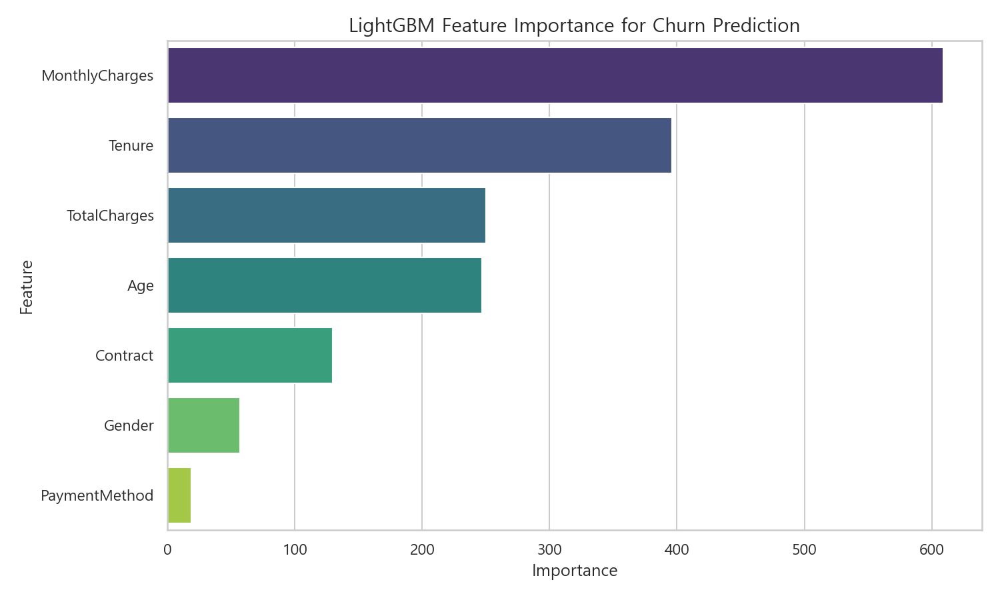

# 산출물 2: 모델 학습 결과 보고서

## 1. 모델링 전략

### 1-1. 평가지표 선정

본 프로젝트는 Telco 고객 이탈(Churn) 예측 문제를 다룬다.  
평가지표는 Accuracy, Recall, Precision, F1-Score, ROC-AUC로 5개 지표를 선정하였다.
최종 모델 선정에서는 ROC-AUC를 가장 중요하게 보고, Accuracy, Precision, Recall, F1-Score를 보조 지표로 함께 확인하였다. ROC-AUC는 모델이 이탈 가능성이 높은 고객과 낮은 고객을 얼마나 잘 구분하는지 보여주므로, 고객별 이탈 위험도를 판단하는 데 중요한 기준이 된다.

| 지표 | 선정 이유 |
| --------- | ------------------------------------ |
| Accuracy | 전체 예측 중 정답을 맞힌 비율을 확인하여 모델의 기본 정확도를 비교하기 위해 선정 |
| Recall | 실제 이탈 고객을 얼마나 놓치지 않고 찾아내는지 평가하기 위해 선정 |
| Precision | 이탈로 예측한 고객 중 실제 이탈 고객의 비율을 확인하여 불필요한 마케팅 대상을 줄일 수 있는지 평가하기 위해 선정 |
| F1-Score | Precision과 Recall의 균형을 함께 평가하기 위해 선정 |
| ROC-AUC | 이탈 고객과 비이탈 고객을 구분하는 전체적인 분류 성능을 평가하기 위해 선정. 특히 고객별 이탈 위험도를 잘 구분하는지 판단하는 핵심 지표로 사용 |

---

### 1-2. 후보 모델 선정

후보 모델은 Random Forest, Gradient Boosting, XGBoost, LightGBM, Deep Learning으로 5개 모델을 선정하였다.

| 모델 | 유형 | 선정 근거 |
| ------------------- | ----- | ------------------------------------------ |
| Random Forest | 앙상블 | 여러 Decision Tree를 결합해 안정적인 성능을 기대할 수 있고, Feature Importance를 통해 주요 변수를 해석할 수 있어 선정 |
| Gradient Boosting | 부스팅 | 이전 모델의 오차를 순차적으로 보정하는 방식으로 정형 데이터 분류에서 성능 개선 가능성을 확인하기 위해 선정 |
| XGBoost | 부스팅 | 정형 데이터 분류 문제에서 성능이 검증된 대표 부스팅 모델이므로, 튜닝을 통한 성능 향상 가능성을 비교하기 위해 선정 |
| LightGBM | 부스팅 | 학습 속도와 메모리 효율이 좋아 데이터가 많아질 경우에도 운영 효율성을 기대할 수 있어 선정 |
| Deep Learning | 신경망 | 트리 기반 모델과 다른 방식의 비선형 패턴 학습 가능성과 성능을 비교하기 위해 선정 |

---

### 1-3. 실험 계획

* 5개 후보 모델(Random Forest, Gradient Boosting, XGBoost, LightGBM, Deep Learning)을 5명의 팀원이 각각 하나씩 담당하여 학습을 진행한다.
* 먼저 공통 비교 기준을 만들기 위해 기본 전처리(음수값 0으로 변환, Label Encoding)를 동일하게 적용한 데이터로 각 모델을 학습한다.
* 이후 각 담당자는 모델 특성에 맞는 추가 전처리와 하이퍼파라미터 튜닝을 적용하여 성능 개선 가능성을 확인한다.
* 최종 비교에서는 기본 전처리 성능과 모델별 전처리 및 튜닝 성능을 함께 제시하여, 동일 조건에서의 모델 성능과 개별 최적화 후 성능을 모두 비교한다.
* 모델 성능은 1-1에서 선정한 5개의 평가지표(Accuracy, Recall, Precision, F1-Score, ROC-AUC)를 기준으로 평가한다.
* 성능 지표뿐만 아니라 각 튜닝 모델의 실행 시간도 함께 측정하여, 예측 성능과 학습 효율성을 모두 비교한다.
* 최종 모델 선정 시에는 ROC-AUC를 핵심 성능 지표로 보고, 모델 간 성능 차이가 크지 않은 경우 실행 시간과 데이터 처리 효율성도 주요 선정 기준으로 함께 고려한다.

---

## 2. 머신러닝 모델 학습 결과

### 2-1. Random Forest

**하이퍼파라미터**

| 파라미터 | 값 |
| ------------ | --------- |
| n_estimators | 100 |
| min_samples_split | 5 |
| min_samples_leaf | 1 |
| max_depth | 5 |

**성능 결과**

| 전처리/학습 조건 | Accuracy | Recall | Precision | F1-Score | ROC-AUC |
| --- | ---: | ---: | ---: | ---: | ---: |
| 기본 전처리 | 0.7600 | 0.7100 | 0.7300 | 0.7200 | 0.8045 |
| 모델별 전처리 및 튜닝 | 0.7600 | 0.7100 | 0.7300 | 0.7200 | 0.8069 |

---

### 2-2. Gradient Boosting

**하이퍼파라미터**

| 파라미터 | 값 |
| --- | --- |
| learning_rate | 0.03 |
| n_estimators | 80 |
| max_depth | 3 |

**성능 결과**

| 전처리/학습 조건 | Accuracy | Recall | Precision | F1-Score | ROC-AUC |
| --- | ---: | ---: | ---: | ---: | ---: |
| 기본 전처리 | 0.7515 | 0.7200 | 0.7200 | 0.7200 | 0.8051 |
| 모델별 전처리 및 튜닝 | 0.7555 | 0.6200 | 0.6400 | 0.6300 | 0.8062 |

---

### 2-3. XGBoost

**하이퍼파라미터**

| 파라미터 | 값 |
| --- | --- |
| n_estimators | 300 |
| learning_rate | 0.1 |
| max_depth | 4 |
| subsample | 0.7 |
| colsample_bytree | 0.8 |

**성능 결과**

| 전처리/학습 조건 | Accuracy | Recall | Precision | F1-Score | ROC-AUC |
| --- | ---: | ---: | ---: | ---: | ---: |
| 기본 전처리 | 0.7082 | 0.6794 | 0.5483 | 0.6068 | 0.7982 |
| 모델별 전처리 및 튜닝 | 0.7260 | 0.6588 | 0.5757 | 0.6145 | 0.8038 |

---

### 2-4. LightGBM

**하이퍼파라미터**

| 파라미터 | 값 |
| --- | --- |
| learning_rate | 0.05 |
| num_leaves | 15 |
| max_depth | 6 |

**성능 결과**

| 전처리/학습 조건 | Accuracy | Recall | Precision | F1-Score | ROC-AUC |
| --- | ---: | ---: | ---: | ---: | ---: |
| 기본 전처리 | 0.7600 | 0.5515 | 0.6668 | 0.6037 | 0.8263 |
| 모델별 전처리 및 튜닝 | 0.7528 | 0.6200 | 0.6300 | 0.6200 | 0.8055 |

---

## 3. 딥러닝 모델 학습 결과

### 3-1. Deep Learning

**모델 구조**  
입력 데이터 (14개)

    │
    ├─ Type Casting (Float64 → Float32)
    │
    ├─ Linear (input_dim → 7)
    ├─ ReLU (활성화 함수)
    ├─ Dropout (p = drop_rate)
    │
    └─ Linear (7 → 1)
        │
        └─ 최종 출력층 (이탈 예측 Logit)

**파라미터 조절 인자**

| 파라미터 조절 인자 | 값 |
| ------------ | --------- |
| epoch | 62 |
| batch_size | 128 |
| threshold | 0.6 |
| learning_rate | 0.001 |
| loss_weight | 2 |

loss_fn = BCEWithLogitsLoss  
optimizer = torch.optim.Adam

**성능 평가**
| 지표 | Validation/Test |
| --- | ---|
| Accuracy | 0.75 |
| Recall | 0.59 |
| Precision | 0.63 |
| F1-Score | 0.61 |
| ROC-AUC | 0.8004 |

---

## 4. 모델 종합 비교 및 최적 모델 선정

### 4-1. 전체 모델 성능 비교표
**1) 기본 전처리(음수값 0으로 변환, Label Encoding)** 
| 순번 | 모델명 | Accuracy (정확도) | Recall (재현율) | Precision (정밀도) | F1-Score | ROC-AUC |
| :---: | :--- | :---: | :---: | :---: | :---: | :---: |
| **1** | **Random Forest** | **0.7600** | 0.7100 | **0.7300** | **0.7200** | 0.8045 |
| **2** | **GradientBoosting** | 0.7515 | **0.7200** | 0.7200 | **0.7200** | 0.8051 |
| **3** | **XGBoost** | 0.7082 | 0.6794 | 0.5483 | 0.6068 | 0.7982 |
| **4** | **LightGBM** | **0.7600** | 0.5515 | 0.6668 | 0.6037 | **0.8263** |
| **5** | **Deep Learning** | 0.7400 | 0.7100 | 0.7100 | 0.7100 | 0.7976 |

 

**2) 모델별 전처리 및 튜닝**
| 순번 | 모델명 | Accuracy (정확도) | Recall (재현율) | Precision (정밀도) | F1-Score | ROC-AUC |
| :---: | :--- | :---: | :---: | :---: | :---: | :---: |
| **1** | **Random Forest** | **0.7600** | **0.7100** | **0.7300** | **0.7200** | **0.8069** |
| **2** | **GradientBoosting** | 0.7555 | 0.6200 | 0.6400 | 0.6300 | 0.8062 |
| **3** | **XGBoost** | 0.7260 | 0.6588 | 0.5757 | 0.6145 | 0.8038 |
| **4** | **LightGBM** | 0.7528 | 0.6200 | 0.6300 | 0.6200 | 0.8055 |
| **5** | **Deep Learning** | 0.7500 | 0.5900 | 0.6300 | 0.6100 | 0.8004 |

 

**3) 튜닝모델 실행시간**

<!-- | 모델명 | 실행 시간(초) |
| --- | ---: |
| Random Forest | 85.04 |
| Gradient Boosting | 69.98 |
| XGBoost | 8.79 |
| LightGBM | 1.96 |
| Deep Learning | 66.06 | -->

  

---

### 4-2. 지표별 최고 성능 모델

**1) 기본 전처리(음수값 0으로 변환, Label Encoding)**

| 지표 | 최고 모델 | 값 |
| --- | --- | ---: |
| Accuracy (정확도) | LightGBM / Random Forest | 0.7600 |
| Recall (재현율) | GradientBoosting | 0.7200 |
| Precision (정밀도) | Random Forest | 0.7300 |
| F1-Score | GradientBoosting / Random Forest | 0.7200 |
| ROC-AUC | LightGBM | 0.8263 |

 

**2) 모델별 전처리 및 튜닝**

| 지표 | 최고 모델 | 값 |
| --- | --- | ---: |
| Accuracy (정확도) | Random Forest | 0.7600 |
| Recall (재현율) | Random Forest | 0.7100 |
| Precision (정밀도) | Random Forest | 0.7300 |
| F1-Score | Random Forest | 0.7200 |
| ROC-AUC | Random Forest | 0.8069 |

 

**3) 튜닝모델 실행시간**

| 최고 모델 | 실행시간 |
| --- | ---: |
| LightGBM | 1.96초 |

---

### 4-4. 최적 모델 선정

**선정 모델**: LightGBM

**선정 근거**

1. 기본 전처리 기준에서는 LightGBM이 ROC-AUC 0.8263으로 가장 높은 분류 구분력을 보였다. 본 프로젝트에서 ROC-AUC를 핵심 지표로 설정했기 때문에, 동일 전처리 조건에서 가장 높은 ROC-AUC를 기록한 LightGBM을 중요하게 평가하였다.
2. 모델별 전처리 및 튜닝 기준에서는 Random Forest가 Accuracy 0.7600, ROC-AUC 0.8069, Precision 0.7300, Recall 0.7100, F1-Score 0.7200으로 가장 좋은 결과를 보였다. 따라서 단순 튜닝 성능만 보면 Random Forest도 충분히 경쟁력 있는 모델이다.
3. 전체 결과를 보면 모델 간 점수 차이가 매우 크지는 않았다. 기본 전처리와 모델별 전처리 및 튜닝 결과 모두에서 상위 모델들의 Accuracy, ROC-AUC, F1-Score 차이가 근소했기 때문에, 단순히 특정 지표 하나의 우위만으로 최종 모델을 결정하기보다는 성능과 운영 효율을 함께 고려하였다.
4. Random Forest는 여러 Decision Tree를 병렬적으로 많이 생성하는 방식이므로, 데이터가 더 많아지거나 트리 수가 증가할수록 학습 시간과 메모리 사용량이 커질 수 있다. 반면 LightGBM은 대용량 정형 데이터 처리에 최적화된 부스팅 모델로, 학습 속도와 메모리 효율 측면에서 강점이 있다.
5. 향후 고객 데이터가 100,000건보다 더 커지거나, 정기적으로 재학습해야 하는 운영 환경을 고려하면 빠른 학습 속도와 효율적인 자원 사용이 중요하다. LightGBM은 이러한 확장성 측면에서 Random Forest보다 운영 부담이 적고, 반복 실험과 모델 개선에도 유리하다.
6. 따라서 최종 모델은 공통 전처리 기준에서 핵심 지표인 ROC-AUC가 가장 높고, 데이터 증가 시 처리 속도와 메모리 효율, 운영 확장성 측면에서도 장점이 있는 LightGBM으로 선정하였다.

---

## 5. 모델 해석

### 5-1. 특성 중요도

최종 모델인 LightGBM 기준 Feature Importance를 확인하였다. 중요도 분석 결과, `MonthlyCharges`가 가장 높은 중요도를 보였고, 그 다음으로 `Tenure`, `TotalCharges`, `Age`가 주요 변수로 나타났다. 이는 고객의 요금 수준, 가입 기간, 누적 이용 금액, 연령 정보가 이탈 예측에 중요한 영향을 준다는 것을 의미한다.

  

주요 Feature는 다음과 같다.

| 주요 Feature | 해석 |
| --- | --- |
| `MonthlyCharges` | 월 청구 금액 수준은 고객이 체감하는 비용 부담과 연결되며, 이탈 가능성을 판단하는 핵심 변수로 작용 |
| `Tenure` | 가입 기간은 고객 충성도와 서비스 이용 안정성을 반영하며, 가입 기간이 짧은 고객일수록 이탈 가능성이 높게 나타날 수 있음 |
| `TotalCharges` | 누적 청구 금액은 고객의 전체 이용 규모를 나타내며, `Tenure`, `MonthlyCharges`와 함께 고객 이용 패턴을 설명 |
| `Age` | 연령대별 서비스 이용 성향이나 가격 민감도 차이가 이탈 예측에 반영될 수 있음 |
| `Contract` | 계약 유형은 고객의 서비스 유지 가능성과 직접적으로 관련되며, 단기 계약 고객은 장기 계약 고객보다 이탈 위험이 높을 수 있음 |
| `Gender` | 성별에 따른 이용 패턴 차이가 일부 반영될 수 있으나, 중요도는 주요 수치형 변수보다 낮게 나타남 |
| `PaymentMethod` | 결제 방식은 고객의 이용 편의성이나 결제 안정성과 관련될 수 있으나, 본 모델에서는 상대적으로 낮은 중요도를 보임 |

---

### 5-2. 주요 변수 기반 해석

LightGBM의 Feature Importance를 바탕으로 보면, 고객 이탈 예측에는 요금 관련 변수와 이용 기간 관련 변수가 가장 크게 작용한다. 특히 `MonthlyCharges`와 `Tenure`는 고객이 서비스를 계속 유지할지 판단하는 데 중요한 신호로 해석할 수 있다.

| 주요 Feature 후보 | 해석 방향 |
| --- | --- |
| `MonthlyCharges` | 월 요금이 높을수록 비용 부담이 커질 수 있으며, 이탈 가능성 증가 요인으로 작용할 수 있음 |
| `Tenure` | 가입 기간이 짧은 고객은 서비스에 대한 고착도가 낮아 이탈 위험이 높을 수 있고, 장기 고객은 상대적으로 유지 가능성이 높을 수 있음 |
| `TotalCharges` | 누적 청구 금액은 고객의 이용 이력과 규모를 나타내며, 가입 기간 및 월 요금과 함께 고객 유지 패턴을 설명 |
| `Age` | 연령에 따라 서비스 이용 목적, 요금 민감도, 계약 선호도가 달라질 수 있음 |
| `Contract` | 월 단위 계약과 장기 계약 간 이탈 위험 차이를 파악하는 데 활용 가능 |
| `PaymentMethod` | 결제 방식에 따라 고객의 서비스 이용 편의성이나 결제 안정성 차이가 나타날 수 있음 |

---

### 5-3. 고위험 고객 프로파일

최종 모델의 주요 변수 해석을 바탕으로, 이탈 가능성이 높은 고객군은 다음과 같이 정리할 수 있다. 이 프로파일은 실제 마케팅 대상 고객을 선별하거나, 이탈 방지 캠페인의 우선순위를 정하는 데 활용할 수 있다.

* 월 청구 금액이 높아 비용 부담이 큰 고객
* 가입 기간이 짧아 서비스 이용 안정성이 아직 낮은 고객
* 누적 청구 금액이 낮거나 이용 이력이 충분히 쌓이지 않은 고객
* 월 단위 계약 등 해지 전환이 쉬운 계약 유형에 속한 고객
* 특정 결제 방식 사용으로 결제 편의성이나 서비스 만족도가 낮을 가능성이 있는 고객
* LightGBM 모델이 산출한 이탈 예측 확률이 0.50 이상인 고객

---

## 6. 결론

본 보고서에서는 Telco 고객 이탈 예측을 위해 Random Forest, Gradient Boosting, XGBoost, LightGBM, Deep Learning 총 5개 후보 모델을 학습하고 비교하였다. 평가는 Accuracy, Recall, Precision, F1-Score, ROC-AUC를 기준으로 진행하였으며, 이 중 고객별 이탈 위험도를 얼마나 잘 구분하는지 확인할 수 있는 ROC-AUC를 핵심 지표로 사용하였다.

실험은 기본 전처리 기준 성능과 모델별 전처리 및 튜닝 성능을 나누어 비교하였다. 기본 전처리 기준에서는 LightGBM이 ROC-AUC 0.8263으로 가장 높은 분류 구분력을 보였고, 모델별 전처리 및 튜닝 기준에서는 Random Forest가 주요 지표에서 가장 높은 성능을 보였다. 다만 전체적으로 모델 간 성능 차이는 크지 않았기 때문에, 최종 모델 선정에서는 성능뿐만 아니라 실행 시간과 데이터 처리 효율성도 함께 고려하였다.

튜닝 모델 실행 시간 비교 결과 LightGBM은 1.96초로 가장 빠른 실행 시간을 보였으며, Random Forest(85.04초), Gradient Boosting(69.98초), Deep Learning(66.06초)보다 학습 효율성이 높았다. 향후 데이터가 100,000건보다 더 많아지거나 정기적으로 재학습해야 하는 운영 환경을 고려하면, LightGBM의 빠른 학습 속도와 메모리 효율은 중요한 장점이 된다.

따라서 최종 모델은 LightGBM으로 선정하였다. LightGBM은 기본 전처리 기준에서 핵심 지표인 ROC-AUC가 가장 높았고, 실행 시간과 운영 효율성 측면에서도 가장 적합한 모델로 판단된다. 또한 Feature Importance를 통해 `MonthlyCharges`, `Tenure`, `TotalCharges`, `Age` 등 고객 이탈에 영향을 주는 주요 변수를 해석할 수 있어, 향후 고위험 고객군을 파악하고 이탈 방지 전략을 수립하는 데 활용할 수 있다.

